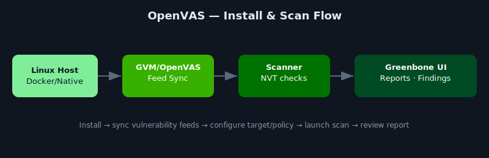

# OpenVAS Vulnerability Scanner Guide

  

This repository provides a complete installation and configuration guide for **OpenVAS**, the open-source vulnerability scanner component of **Greenbone Vulnerability Management (GVM)**.



---

## What Is OpenVAS?

[OpenVAS](https://www.greenbone.net/en/) (Open Vulnerability Assessment System) is a full-featured vulnerability scanner maintained by Greenbone Networks. It is used to detect security issues in networked systems and provides reports on potential vulnerabilities.

---

## Requirements

- OS: Ubuntu 20.04+ (recommended) or Debian 11+
- Minimum 4 GB RAM, 2+ CPU cores
- Root or sudo access
- Internet connection (for vulnerability feed updates)
- Open ports: TCP 9392 (web UI), TCP 5432 (PostgreSQL)

---

## Installation (Ubuntu 22.04+)

### 1. Update System

```bash
sudo apt update && sudo apt upgrade -y
```

### 2. Install Required Dependencies

```bash
sudo apt install -y software-properties-common
sudo add-apt-repository ppa:mrazavi/gvm
sudo apt update
sudo apt install -y gvm
```

### 3. Set Up and Initialize OpenVAS

```bash
sudo gvm-setup
```

This step will:
- Create certificates
- Set up PostgreSQL
- Download the vulnerability feeds

> First-time setup may take 15–30 minutes.

---

## ▶Start OpenVAS Services

```bash
sudo gvm-check-setup
sudo gvm-start
```

Check status:

```bash
sudo gvm-status
```

---

## Access the Web Interface

Once started, open a browser and go to:

```
https://localhost:9392
```

> Default username is usually `admin` (password shown after setup)

---

## Run a Scan

1. Log in to the GVM web UI
2. Navigate to **Scans > Tasks**
3. Create a new scan task
4. Select target IP range and scan config (e.g., Full and Fast)
5. Start the scan and view reports

---

## Updating Feeds

To keep vulnerability data current:

```bash
sudo greenbone-feed-sync --type SCAP
sudo greenbone-feed-sync --type CERT
sudo greenbone-feed-sync --type GVMD_DATA
```

---

## What I Learned / Skills Demonstrated

- **Open-source vulnerability scanning stack** — how GVM/OpenVAS splits responsibilities across the scanner, the GVMD daemon, and the Greenbone web UI, versus a monolithic commercial tool.
- **Feed management** — why NVT/SCAP/CERT feeds need regular syncing and how stale feed data quietly degrades scan accuracy.
- **Cost-conscious tooling choices** — when an open-source scanner is the right call vs. a commercial license, and what tradeoffs (feed freshness, support, UI polish) come with that choice.
- **Linux service troubleshooting** — diagnosing service startup issues during install rather than treating the install script as a black box.

**Problem solved:** documented a working, free alternative to commercial vulnerability scanners for labs and small environments where licensing cost isn't justified.

---

## References

- [OpenVAS Installation Guide](https://greenbone.github.io/docs/)
- [Greenbone Community Edition](https://community.greenbone.net/)
- [GVM Tools on GitHub](https://github.com/greenbone)

---

## Contributing

Pull requests and issue reports are welcome. Feel free to share improvements or scripts.

---

## License

This documentation is licensed under the MIT License. See [LICENSE](./MIT%20License.txt) for more info.

---

Strengthen your security posture by scanning with OpenVAS.